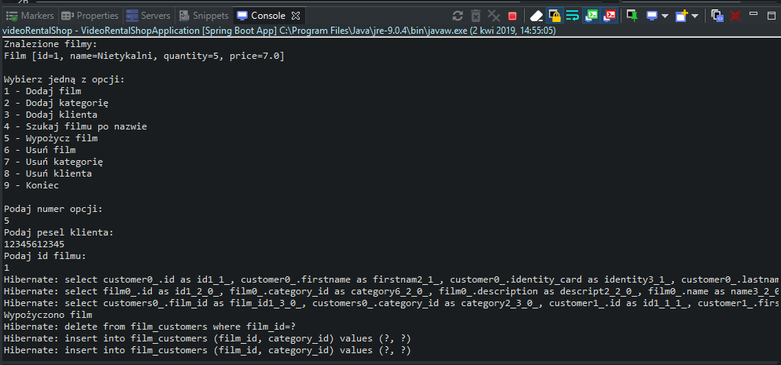

# VideoRentalShop
> The application for managing video rental.

## Table of contents
* [General info](#general-info)
* [Screenshots](#screenshots)
* [Technologies](#technologies)
* [Status](#status)

## General info
The application was created to improve knowledge through the training.

Available functionalities:

adding new films,
adding new categories,
adding new clients,
searching films by name,
movie rental,
removing films
removing categories
removing clients.

## Screenshots

## Technologies
* JDK 9
* Maven 3.5.4
* Spring Boot 2.1.2
* Spring Data

## Status
Project is: _finished_